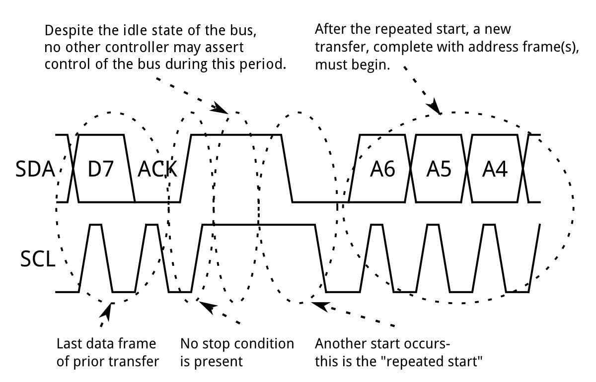
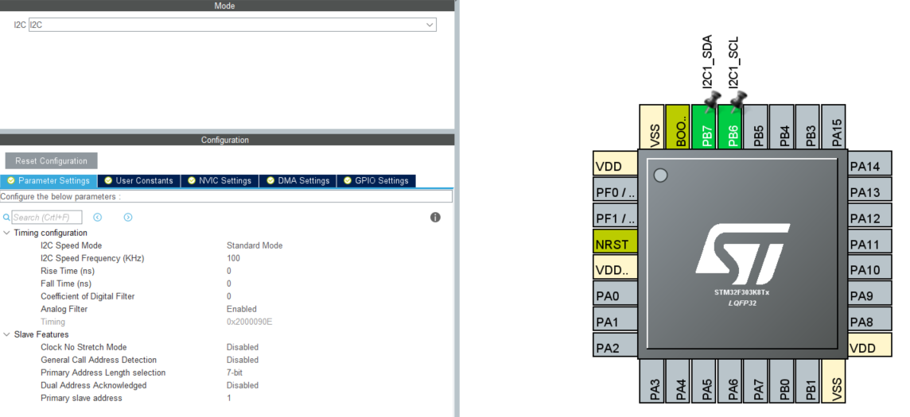
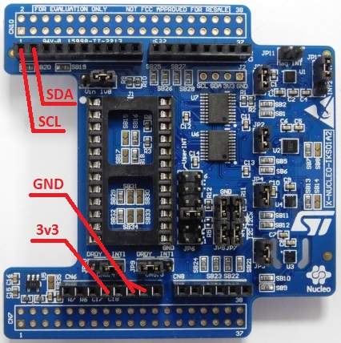
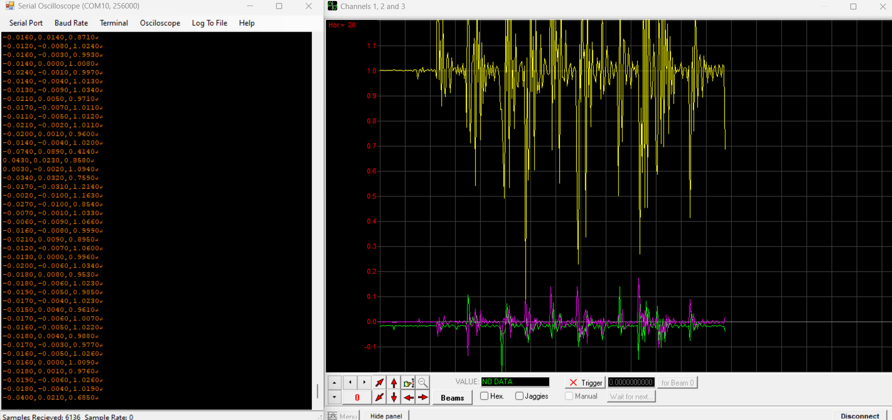

# Náplň cvičenia
- zoznámenie sa s I2C
- komunikácia s IMU prostredníctvom I2C
- predstavenie zadania s I2C a senzorom

# I2C zbernica

### Základné posielanie dát

    

### Posielanie väčšieho množstva dát

    

# Konfigurácia I2C

    

- na obrázku je zobrazená konfigurácia I2C - okrem zobrazených parametrov je nutné povoliť globálne prerušenia od I2C ("error interrupt" nie je momentálne potrebný)
- MCU má rolu "master", číta z registrov alebo zapisuje do registrov senzora ("slave") 

# IKS01A1 senzorová doska

    

- obsahuje viacero senzorových jednotiek: magnetometer (LIS3MDL), IMU - acc + gyro (LSM6DS0), sonzor vlhkosti a teploty (HTS221), barometrický snímač (LPS25HB) ...
- v tomto prípade MCU komunikuje s IMU (acc a gyro) LSM6DS0
- na obrázku je znázornené zapojenie senzorovej dosky k vývojovej doske s MCU

- ukážkový program komunikuje s LSM6DS0 prostredníctvom I2C a číta hodnotu zrýchlení v osiach x, y, z

# Serial oscilloscope

    

- aplíkácia pre vykreslovanie dát, ktoré sú priaté prostredníctvom sériovej komunikácie vo formáte CSV (comma-separated values) - napríklad "123,158,39.789,5639"
- možnosť používať aj ako obyčajnú terminálovú aplikáciu (Putty)
- nutnosť nastaviť COM port a prenosovú rýchlosť (baud rate)
- po kliknutí na "Osciloscope" za otvorí nové okno s grafickým zobrazením priebehov (maximálne 9 kanálov, 3 kanály pre jedno okno), s ktorým je možné manipulovať (posúvať priebeh, meniť časovú základňu a rozsah zobrazovaných hodnôt)
- k dispozícii na stiahnutie tu: https://x-io.co.uk/serial-oscilloscope/  

# Zadanie 5 (10b)

Vytvoriť aplikáciu, ktorá bude posielať dáta získané zo senzorov (LPS25HB, HTS221) cez USART do PC. Zobrazovanými údajmi budú teplota, relatívna vlhkosť vzduchu, tlak vzduchu a relatívna výška od zeme.

### Úlohy

1. Vytvorenie vlastného projektu pomocou CubeMX a vlastného git repozitára - viditeľné commity, nastavenie ".gitignore".

2. Vytvorenie funkcii v zdrojovom súbore "i2c.c" pre čítanie a zápis dát po I2C zbernici s možnosťou single aj multi byte prenosu (čítanie/zápis). Ak hodnota registra pozostáva z viacerých bytov, musí sa použit multi-byte prenos a byť vyčítaná naraz (nie postupne po bytoch vo viacerych čítaniach). Funckie z "i2c.c/h" nesmú byť priamo používané v knižnici senzora ale musia byť registrované ako "callback funkcie" (oddelenie konfiguracie MCU od konfiguracie senzora a jeho aplikacie).

3. Vytvoriť si vlastnú knižnicu pre senzory LPS25HB a HTS221
   - Vytvoriť zdrojový priečinok - v "Project explorer" -> pravé kliknutie na "Váš project" -> "new" -> "Source folder" (názov priečinku podľa názvu senzora) -> pravé kliknutie na nový priečinok a "Add/remove include path ..." .
   - V prečinku senzora vytvoriť zdrojový a hlavičkový súbor pre daný senzor.
   - V hlavičkovom súbore sa budú nachádzať makrá pre adresy registrov senzora a prípadne hodnoty daných registrov. Taktiež dekláracie funkcii pre prácu so senzorom.
   - V zdrojovom súbore sa budú nachádzat vaše vlastné funkcie pre inicializáciu, vyčítavanie a zapisovanie dát zo/do senzora, spracovanie vyćítaných dát, získanie hodnoty meranej veličiny.
     
4. Knižnica musí obsahovať inicializačnú funkciu, ktorej úlohou je overiť pripojenie senzora a musí vykonať počiatočnú konfiguráciu senzora. Ako prvé overíte, či viete prečítať "WHO_AM_I" register a či hodnota, ktorú vám senzor vráti je totožná s hodnotou z dokumentácie. Následne zapíšete do registrov sonzora svoju vlastnú konfiguráciu. Prejdite si dokumentáciu, zistite čo všetko viete nastavovať pomocou registrov a podľa potreby si zvoľte vlastnú konfiguráciu senzora (frekvencia merania, merací rozsah ... ).

5. Knižnica musí obsahovať funkciu na čítanie/zapisovanie dát zo/do senzora. Zapisovanie do senzora bude slúžiť napr. pri konfigurácii senzora a čítanie bude slúžiť na získavanie aktuálneho stavu senzora (ak je to potrebné), hodnôt meraných veličín ... . Ak zo senzora budete čítať viac ako jednu veličinu (napr. teplota a vlhkosť), tak pre každú meranú veličinu vytvorte samostatnú funkciu na jej čítanie.

6. Údaje, ktoré sa majú zobrazovať ale nie su priamo získateľné zo senzora je potrebné na základe dostupných meraných hodnôt vypočítať (napr. relatívna výška od zeme, ...). Pre takýto "post processing", kedy sa z meraných údajov snažite niečo vypočítať vytvorte samostatnú funkciu.

7. Údaje sa budú posielať cez USART vo formáte CSV a zobrazovať na PC pomocou "serial osciloscope".

8. Formátovanie odosielaných hodnôt. Hranatá zatvorka predstavuje v akých jednotkách je zobrazovaná hodnota. Niektoré hodnoty sú zobrazované s presnosťou na 1 alebo 2 desatinné miesta. "xx.x" predstavuje digity vyhradené pre číslice - jedno desatinné miesto, jednotky a desiatky:
   - teplota [°C]: "xx.x"
   - rel. vlhkosť [%]: "xx"
   - tlak vzduchu [hPa]: "xxxx.xx"
   - relatívna výška od zeme [m]: "xxx.xx"
   
9. Odovzdáva sa projekt osobne na začiatku 8. cvičenia + počas odovzdávania sa skontroluje aj git.
